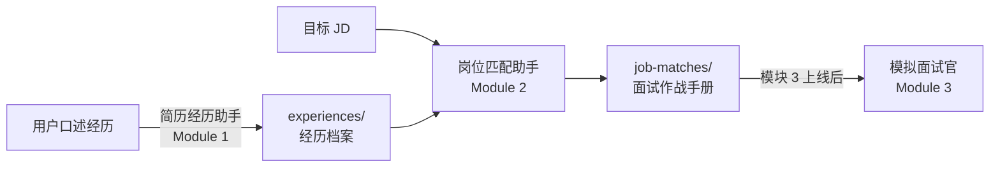

# 岗位匹配助手（Job Match Advisor）

面试前一天，你打开 JD，读了三遍，觉得自己"应该能行"，然后合上电脑。

然后你进了面试，面试官问"你做过最有成就感的产品决策是什么"，你脑子里有很多东西，但就是说不出那个最有说服力的版本。

这个 Skill 做一件事：在你进面试之前，帮你把"功课"彻底备完。

---

## 它能做什么

输入一份 JD + 你的经历档案（来自[简历经历助手](https://github.com/hirclelili/experience-refinery)），输出一份完整的"面试备战作战手册"：

| 内容 | 说明 |
|------|------|
| **JD 拆解** | 把 JD 拆成硬技能/软技能/业务理解/加分项，识别没写出来的隐含要求 |
| **匹配度诊断** | 对每条要求做四档诊断（🟢直接命中/🟡需重新包装/🟠部分覆盖/🔴真gap），不美化 |
| **面试问题预测** | 15-25 道 L3 深度问题，每道含完整应答策略：建议用哪段经历、重点突出什么、可以埋什么钩子、面试官想看到什么信号、常见踩坑 |
| **面试前 24 小时清单** | 按岗位定制的备战 checklist |

**只做"备课"，不做"上课"**——本模块是静态文档产出，不做模拟问答（那是[模块 3](https://github.com/hirclelili/mock-interviewer) 的工作）。

---

## 与模块 1 的协同



**推荐流程**：先用模块 1 整理好经历档案，再用本模块做 JD 匹配——问题预测会精准关联到你具体的经历 ID，而不是泛泛的"找一段相关经历"。

---

## 快速安装

### Claude Code 用户

```bash
# 克隆到 skills 目录
git clone https://github.com/hirclelili/job-match-advisor \
  ~/.claude/skills/job-match-advisor

# 验证安装
ls ~/.claude/skills/job-match-advisor/SKILL.md
```

安装后，在 Claude Code 的任意对话里说"帮我准备抖音产品经理的面试"即可触发。

### 与简历经历助手配合使用

```bash
# 推荐在有 experiences/ 的目录下运行
cd ~/你的求职准备文件夹
# 确保 experiences/ 目录存在（来自模块 1 的输出）
ls experiences/

# 然后在 Claude Code 里说：
# "帮我分析这个 JD，[粘贴 JD 内容]"
```

---

## 使用示例

**Step 1：触发**
> "我拿到了抖音创作者产品 PM 实习的面试，帮我备战"

**Step 2：岗位匹配助手找到经历档案**
```
我找到了你的经历档案：

📁 experiences/
├── exp-douyin-pm-intern-2023  抖音电商·产品实习（2023.07-09）
├── exp-content-ops-intern-2022  某内容平台·运营实习（2022.12-03）
└── exp-campus-app-ux-2023  校园App用户体验研究（2023.03-05）

请把 JD 粘贴给我，我来开始分析。
```

**Step 3：粘贴 JD，确认拆解结果**

岗位匹配助手输出 JD 拆解表，等你确认后继续。

**Step 4：生成作战手册**

```
作战手册已生成！

📁 job-matches/抖音-PM实习-20240115/
├── 📄 battle-plan.md  ← 主文件
└── 📄 jd-summary.md   ← JD 拆解卡片

共预测了 20 道面试题。
匹配度：🟢×2 · 🟡×3 · 🟠×1 · 🔴×3（含2条非核心加分项）

重点关注：
- 核心优势：字节实习全链路产品经历 + 创作者调研一手经验
- 需注意的 gap：SQL 从未使用，面试前建议突击基础语法
```

查看完整示例输出：[examples/output/battle-plan.md](examples/output/battle-plan.md)

---

## 诚实诊断原则

很多面试准备工具倾向于告诉你"你很棒"。这个工具不这样做。

**为什么诚实 > 讨好**：
- 拿着"美化过的诊断"去面试，遭遇真实追问时更容易出丑
- 提前知道 🔴 gap 才能提前准备应对策略
- 假装 🟡/🟠 的候选人进了面试，反而更容易暴露

工具内置了明确规则：**宁可标低一档，也不标高一档**。

---

## 输出文件结构

```
job-matches/
└── [公司名]-[岗位]-[日期]/
    ├── battle-plan.md    # 面试作战手册（8章节，15-25题）
    └── jd-summary.md     # JD 拆解卡片
```

**battle-plan.md 八章节**：
1. 岗位概览（公司类型 + 面试风格预判）
2. JD 拆解摘要
3. 匹配度诊断（🟢🟡🟠🔴 + 🔴 应对策略）
4. 我的优势（3-5 条，含可直接说的话）
5. 短板与应对（2-3 条，提前想好怎么回答）
6. 面试问题预测（L3 深度，含逐题应答策略）
7. 面试前 24 小时备战清单
8. 衔接模块 3 说明

---

## 降级方案：纯 Prompt 版

如果你使用的是 ChatGPT、DeepSeek、Kimi 或其他 LLM，可以复制以下 prompt 直接使用。不需要安装，输出在对话里显示。

---

```
你是一个面试备战专家，帮我把"备课"彻底做完。我会给你一份 JD 和我的简历/经历描述，你的任务是输出一份完整的面试备战分析，包含以下内容：

## 一、JD 拆解

把 JD 拆成四个维度：
- 硬技能（Hard Skills）：可证伪的工具/方法/输出能力（如SQL、用户调研、PRD写作）
- 软技能（Soft Skills）：协作沟通等（如跨部门推动、结构化表达）
- 业务理解：对行业/用户/产品的认知要求
- 加分项：JD 明确写"优先/加分"的项

同时识别 JD 中的隐含要求（没写出来但实际考察的内容）。

输出格式：
| ID | 维度 | 要求 | 原文 | 等级（必须/优先/隐含） |

## 二、匹配度诊断

对每条 JD 要求，用四档诊断对照我的经历：
- 🟢 直接命中：有明确经历+数据支撑，直接可用
- 🟡 需重新包装：做过，但表达角度不对，说明如何重新表达
- 🟠 部分覆盖：做过相关但深度不足，勉强能讲但追问会露底
- 🔴 真gap：完全没做过，诚实标注，给出面试应对模板

**重要原则：诚实>讨好。宁可标低一档，不要美化诊断档位。**

对于 🔴 真gap，给出三步应对模板：
1. 坦诚承认：直接说"这方面我目前还没有直接经验"
2. 展示学习行动：我已经做了什么/打算做什么
3. 用最接近的经历降低风险

## 三、我的优势

从诊断结果提炼 3-5 条核心优势（多个🟢汇聚成的差异化竞争力），每条包含：
- 优势描述
- 可关联的经历
- 可以说的一句话（可以在开场或成就类问题时主动用）

## 四、面试问题预测（最核心部分）

**必须生成 15-25 道题，不能少。**

问题来源要覆盖：
- JD 直接派生：每条硬技能/软技能/业务理解要求生成 1-2 题
- 经历深挖：对我最亮眼的 1-2 段经历深挖 2-3 题
- 岗位通用必问：自行判断岗位类型，选 4-5 道必问题
- STAR 行为题：2-3 道通用高频行为题
- 业务情境题：1-2 道"如果你是这个岗位，你会怎么做"类
- 动机类：2-3 道"为什么/职业规划"类

**每道题必须包含**：
- 考察点：这道题在考什么
- 难度：基础/进阶
- 应答策略：
  - 🎬 建议用哪段经历（理由1-2句）
  - ✨ 重点突出（2-3条，说明体现什么品质）
  - 🪝 可埋钩子（一句可以引导追问的话）
  - 🎯 面试官想看到的信号（2-3个）
- 常见踩坑（2条）

如果某道题涉及我没有经历的内容（真gap），用以下格式：
⚠️ 真gap类问题
- 应对思路：[三步模板]
- 不要做：[具体禁忌]

## 五、面试前24小时备战清单

分三类：内容复习 / 公司研究 / 心理准备，按这个具体岗位定制。

---

## 开始

请把以下两个内容发给我：
1. 目标岗位的 JD（直接粘贴）
2. 你的简历或经历描述（可以是口语化描述，不需要整理好）

我来做分析。
```

---

## 模块系列

| 模块 | 状态 | 功能 |
|------|------|------|
| [简历经历助手](https://github.com/hirclelili/experience-refinery)（模块 1） | v1.2 当前 | 经历整理 → 简历条目 + 完整故事 + 面试工具包 |
| **岗位匹配助手（本 Skill）** | **v1.0 当前** | **JD 分析 + 匹配诊断 + 面试问题预测** |
| 模拟面试官（模块 3） | 规划中 | 基于作战手册生成追问，模拟真实面试对话 |
| 求职策略师（模块 4） | 规划中 | 整合所有经历，给出投递策略和 timeline |

---

## 5 分钟快速试用

用以下这份测试 JD 试用：

```
【岗位】某互联网公司 · 内容产品经理实习生

负责内容推荐相关产品的设计与迭代；
独立完成用户调研，输出调研报告；
撰写 PRD，跟进需求全流程；
对已上线功能进行数据分析；
有 SQL 基础者优先；
在跨职能团队中推动需求落地。

可实习时间 3 个月以上优先，对内容推荐/算法机制有理解者加分。
```

1. 安装完成后，打开 Claude Code
2. 输入："帮我分析这个 JD，备战面试"
3. 粘贴上面的 JD
4. 描述你的经历（口语化就行）
5. 确认 JD 拆解结果后，等待生成作战手册

总耗时：5-15 分钟

---

## 反馈与贡献

遇到问题或有改进建议，请提 [GitHub Issue](https://github.com/hirclelili/job-match-advisor/issues)。

特别欢迎：
- 你用这个 Skill 生成的真实输出（可脱敏后分享）
- 非产品/运营岗的使用反馈（数据/技术/市场岗的问题预测是否准确）
- 匹配诊断"标错档位"的案例（对改进诚实诊断规则很有帮助）

---

## License

MIT License. 详见 [LICENSE](LICENSE).
